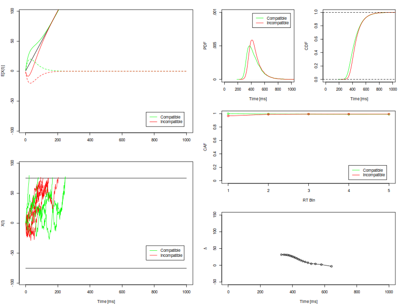
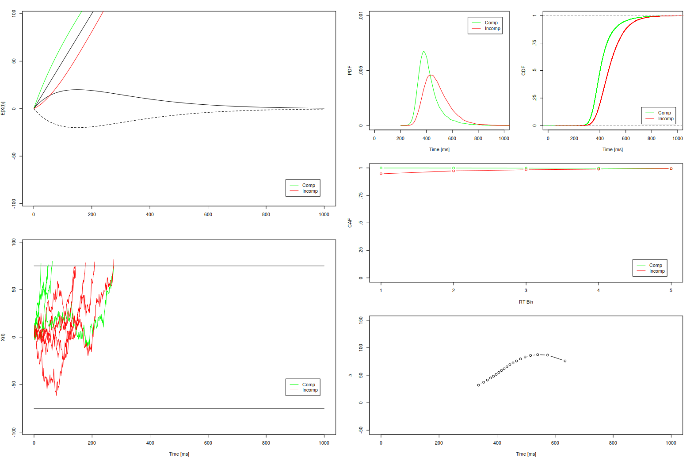
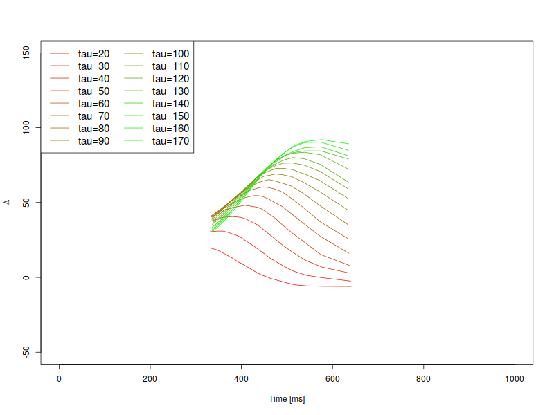
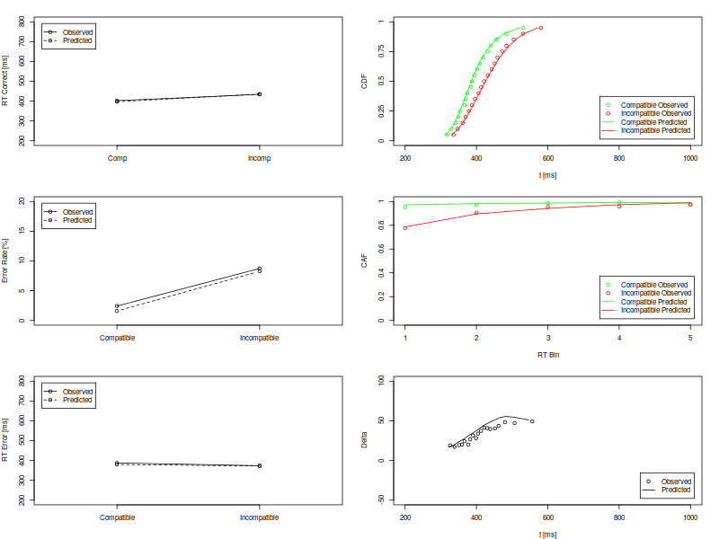
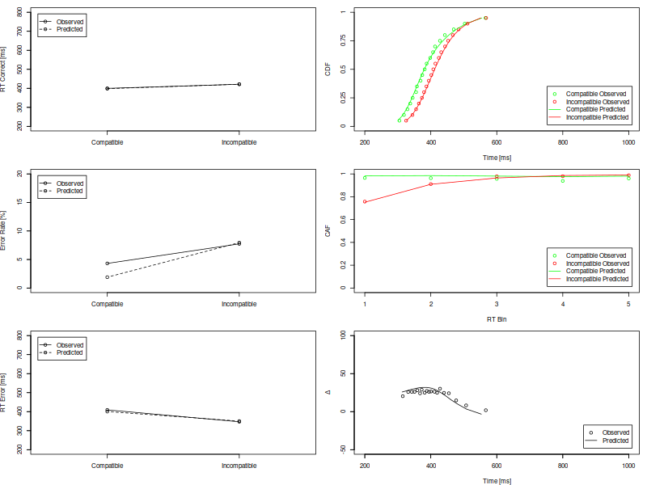
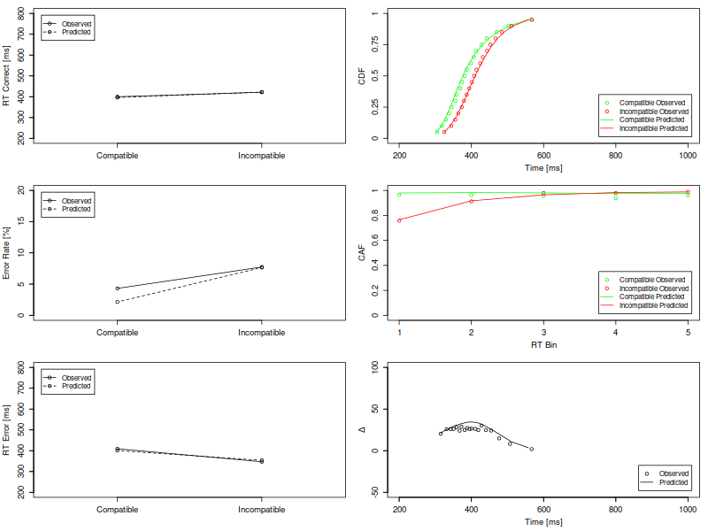

# DMCfun
R/Cpp implementation of the diffusion process model (Diffusion Model for
Conflict Tasks, DMC) presented in Automatic and controlled stimulus processing
in conflict tasks: Superimposed diffusion processes and delta functions
(https://www.sciencedirect.com/science/article/pii/S0010028515000195)

CRAN https://cran.r-project.org/web/packages/DMCfun/index.html

## Installation

``` r
# install version from CRAN
install.packages("DMCfun")
library(DMCfun)

# install version from  GitHub
# install.packages("devtools")
devtools::install_github("igmmgi/DMCfun")
```

---
## Basic Examples DMC Simulation
``` r
dmc <- dmcSim(fullData = TRUE)
plot(dmc)
```
     

``` r
dmc$means
  Comp   rtCor sdRtCor perErr rtErr sdRtErr
1 comp    440.   105.   0.633  479.   104. 
2 incomp  459.    94.8  1.38   406.    95.2
```

``` r
dmc <- dmcSim(fullData = TRUE, tau = 150)
plot(dmc)
```
     

``` r
dmc$means
  Comp   rtCor sdRtCor perErr rtErr sdRtErr
1 comp    421.    90.4  0.259  504.   119. 
2 incomp  484.   103.   2.37   425.    82.7
```

``` r
params <- list(tau = seq(20, 170, 10))
dmc <- dmcSims(params)
plot(dmc, ncol = 2, col = c("red", "green"))
```
     

## Basic Examples DMC Fit: Real data using optimr (Nelder-Mead)
``` r
fit <- dmcFit(flankerData) # flanker data from Ulrich et al. (2015)
plot(fit, flankerData)
```
     

``` r
summary(fit)
    amp   tau   drc  bnds resMean resSD aaShape spShape sigm  rmse
1  19.3  98.8 0.593  55.8    325.  28.4    2.26    2.84     4  8.91
```

``` r
fit <- dmcFit(simonData) # simon data from Ulrich et al. (2015)
plot(fit, simonData)
```
     

``` r
    amp   tau  drc  bnds resMean resSD aaShape spShape sigm  RMSE
1 16.91 47.77 0.59 56.68  317.16 33.43    1.68    3.53    4 10.01
```

## Basic Examples DMC Fit: Real data using DEoptim
``` r
fit <- dmcFitDE(flankerData) # flanker data from Ulrich et al. (2015)
plot(fit, flankerData)
```
     

``` r
summary(fit)
    amp    tau  drc  bnds resMean resSD aaShape spShape sigm RMSE
1 17.26 222.19 0.64 57.49  328.06 28.41     1.7    2.18    4 5.79
```

``` r
fit <- dmcFitDE(simonData) # simon data from Ulrich et al. (2015)
plot(fit, simonData)
```
     

``` r
    amp   tau  drc  bnds resMean resSD aaShape spShape sigm RMSE
1 14.31 42.29 0.55 57.54  308.63 25.98    2.15    3.56    4 8.86
```


